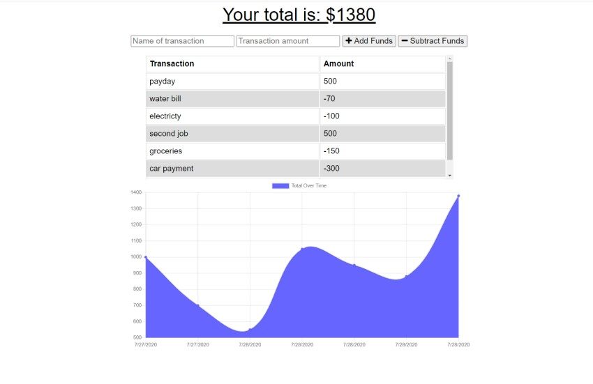

<h1 align="center">Budget Tracker</h1>

<p align="center">


</p>

<p align="center">
    
</p>


## Table of Contents
- [Description](#description)
- [Installation](#install)
- [Usage](#usage)
- [Questions](#questions)

## Description
### Budget Tracker is a Progressive Web Application (PWA) that gives the user online and offline ablity to track their income and outgoing expenses. 


## Install
```
npm install

```

## Usage
### In the terminal Run  
```
npm start

http://localhost:3001/
```

## Below is a link to the GitHub repository   
[Budget Tracker](https://github.com/mattkohl82/budget-tracker)    

### Heroku deployment page 
[Budget Tracker](https://budget-tracker-82.herokuapp.com/) 


## Questions
### [Mattkohl82 for GitHub](https://github.com/Mattkohl82)  
### mattkohl82@gmail.com for ✉️ email 
